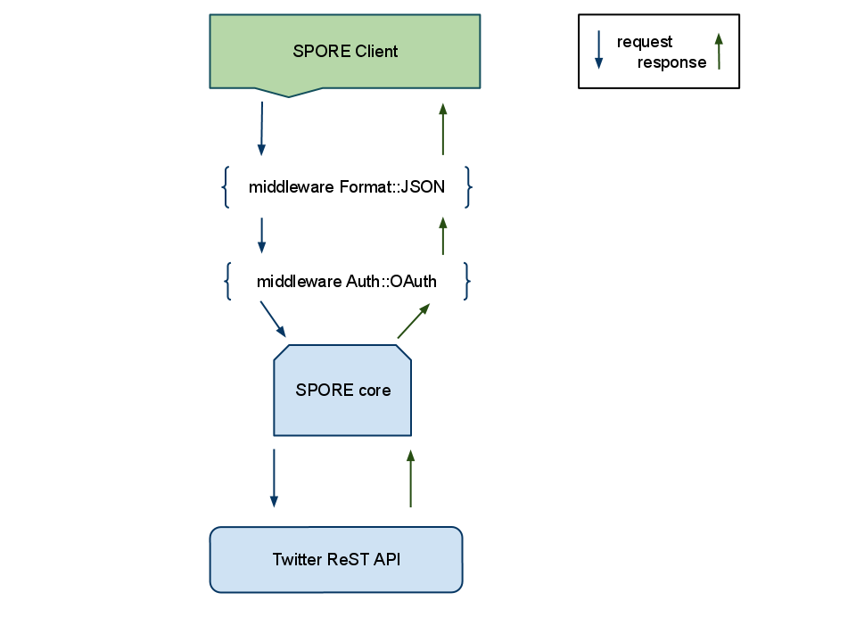

!SLIDE bullets
# Comment utiliser une API Rest ?

* lire la doc
* utiliser une implémentation existante dans votre langage préféré

!SLIDE bullets

# Don't repeat yourself

!SLIDE bullets

# Don't repeat yourself

# Don't repeat yourself

!SLIDE
# Comment décrire une API Rest (et faciliter l'écriture de client) ?

!SLIDE bullets
# Specifications for a POrtable Rest Environment

* Description de l'API
* Implémentation du client

!SLIDE bullets small
# Description de l'API

    @@@ Javascript
    {
      "base_url" : "http://api.twitter.com/1",
      "version" : "0.1",
      "methods" : {
      "public_timeline" : {
        "optional_params" : [
          "trim_user",
          "include_entities"
         ],
         "required_params" : [
           "format"
          ],
          "path" : "/statuses/public_timeline.:format",
          "method" : "GET"
       }
    }

!SLIDE bullets
# Pour chaque méthode, on décrit

* son uri
* le verbe HTTP
* les paramètres optionnels et obligatoires
* les entêtes http
* ...

!SLIDE bullets
# Implémentation des clients

* Implémentation similaire dans différents langages
* Pas besoin de mettre à jour les clients si l'API change

!SLIDE
# Code

    @@@ Javascript
    var client = spore.createClient(
        __dirname +'/statusnet.json');

    client.public_timeline({format: 'json'},
                           function(err, res) {

        console.log(err, res);
    });

!SLIDE bullets
# Middlewares

* Se charge de tout le travail spécifique
* Avant que vous fassiez la requête
* A la réponse de l'API

!SLIDE center

!SLIDE bullets
# Middlewares

* Rajouter les informations d'authentification
* Mettre en cache les réponses
* Désérialiser la réponse
* Réparer l'API ?

!SLIDE

## [github.com/senchalabs/connect/](https://github.com/senchalabs/connect/)

!SLIDE small
# Exemple

    @@@ Javascript
    var oauth2 = require('spore/middlewares').oauth2;

    client.enable(oauth2('access_token'));

    client.home_timeline({format: 'json'}, function(err, res) {
        console.log(err, res);
    });

!SLIDE small
# enable/enable_if/disable

Ajout de middlewares au démarrage

    @@@ Javascript
    spore.createClient(middleware, __dirname+'twitter.json');

Plus tard

    @@@ Javascript
    client.enable(middleware);

Seulement dans certains cas

    @@@ Javascript
    client.enable_if(function(method, request) {
       if (method.uri == '/user') {
           return true;
       }
    }, middleware);

!SLIDE small
# Implémentation (qui modifie les paramètres)

    @@@ Javascript
    function myMiddleware() {

        return function(method, request, next) {
            request.params["format"] = "xml";
            next();
        }

    }

!SLIDE small
# Implémentation (qui fait une chose asynchrone)

    @@@ Javascript
    function myMiddleware() {

        return function(method, request, next) {

            fs.stat(path, function(err, stats) {

                next();
            }) ;
        }

    }

!SLIDE small
# Appel a la réponse

    @@@ Javascript
    function myMiddleware() {
        return function(method, request, next) {
            next(function(response, next) {
                response.body = 'plop';
                next();
            });
        }
    }

!SLIDE bullets

# Et la partie serveur ?

* un prototype existe qui utilise [expressjs](http://expressjs.com/)

!SLIDE small

# Exemple

    @@@ Javascript
    var app   = require('express').createServer();
    var spore = require('spore');
    spore.createServer(app, __dirname +'/twitter.json', {

        public_timeline: function(req, res) {
            res.send('Hello word !');
        }

    });
    app.listen(3000);

!SLIDE bullets
# Liens

* https://github.com/SPORE/specifications/
* https://github.com/francois2metz/node-spore
